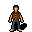

## 1. Aims

* Apply object-oriented programming principles and design patterns
* Synthesise and adapt to changes in user requirements
* Practice agile software development in a team environment
* Work with the Java Programming Language and Java Class Libraries
* Learn practical aspects of graphical user interface development
* Appreciate issues in design and development
* Design reusable software solutions

## 2. Client Requirements 🧳

The client wants you to develop a game application called "Loop Mania" as described below. The proposed game application is like the application "Loop Hero" ([free download is available here](https://fourquarters.itch.io/loopathero-demo?ref=dtf.ru)) with many major changes, so please read the requirements below, as you need to follow them for this project.

The following describes the features the client wants in Loop Mania.


The game world contains a path composed of image tiles ([see more details in this document](TILES_README.md)) which forms a loop. The Character automatically moves clockwise from position to position through this path, starting from the Hero's Castle  (see [example in separate file:moving through path](examples/moving_through_path_simple_example.png)).

The game world contains buildings (see [buildings table below](#22-buildings-%EF%B8%8F)), enemies (see [enemies table below](#21-enemies-)), gold , health potions , and the Character . You can see more information about gold and health potions in the [items table below](#23-basic-items-%EF%B8%8F). Enemies will move around the path, and their method of doing so depends on the enemy type.

It is important to note that in this document, the *Human Player* and *Character* are distinct:
* The *Character* refers to the main Character within the game which the Human Player wishes to help win the game, represented by a picture of a person . The Character completes many interactions such as moving around and fighting battles automatically, without input from the Human Player.
* The *Human Player* refers to the user playing the game application. The Human Player wishes to win the game by helping the Character complete all goals, and is able to help the Character win the game by creating buildings (see [buildings table below](#22-buildings-%EF%B8%8F)), equipping items (see [items table below](#23-basic-items-%EF%B8%8F)), purchasing and selling items, consuming health potions, and pausing the game (pausing makes it easier to drag and drop).

When the Character is attacked by an enemy, a battle is started involving nearby enemies and the Character, and either the Character will defeat all enemies within this battle and win rewards, which can consist of cards (see [buildings table below](#22-buildings-%EF%B8%8F)), experience, gold, and equipment (see [items table below](#23-basic-items-%EF%B8%8F)). Alternatively, the Character will be killed and the Human Player loses the game, and the game ends. The battle is automatically played - the Human Player has no ability to perform any game interactions during a battle.

More precisely, when the Character moves within the *battle radius* of an enemy on the path (this differs by type of enemy), a battle will commence. Those enemies for which the Character is within their *support radius* (*support radius* is distinct from *battle radius*, and differs by type of enemy) will join the battle against the Character and its allies. Some enemies such as vampires have a larger support radius (see [enemies table below](#21-enemies-)).


In the example above, when the Character moves to the position indicated by the red arrow, the Character will be within the battle radius of the slug, and within the support radius of the vampire, so a battle will be started between the Character and the slug, and the vampire will join the battle in support of the slug.
These radii are calculated as a straight-line distance in the above example (the circles are drawn to indicate the distance around the vampire/slug, you do not need to draw circles in your application). You can implement calculation of distance differently if you prefer.

Challenging bosses spawn when specified conditions are met. Killing them provides special items and larger experience upgrades.

The Character may lose health from a battle. Health can be restored fully by consuming a health potion (see [example in separate file:using health potion](examples/simple_example_health_potion.png)). Health potions can be bought from the Hero's Castle, taken from dead enemies, picked up from the ground, or obtained when a [card is destroyed due to having too many cards (as below)](#custom_anchor_name_cards_destroyed). You should determine in your design how best to allow the Character to consume a health potion.

Gold can be obtained by selling items at the Hero's Castle, by killing enemies, or by picking it up from the ground, when a [card is destroyed due to having too many cards (as below)](#custom_anchor_name_cards_destroyed), or when an [item is destroyed due to having too many items (as below)](#custom_anchor_name_items_destroyed).

<a name="custom_anchor_name_cards_destroyed"></a>
Cards are received when the Character defeats enemies (1 or more will be received at the bottom of the screen, as in this [example in separate file:gold/experience/cards](examples/cards_gold_experince_simple_example.png)). The Human Player can drag and drop these cards onto appropriate places on the map which depend on the building type, as outlined in the [buildings table below](#22-buildings-%EF%B8%8F) (see examples in separate files [here:drop locations](examples/simple_example_drop_locations.png), and [here:dragging cards](examples/simple_example_dragging_cards.png)). Dropping a card on a valid location spawns the building corresponding to that card at the location of the drop. The Human Player will want to create buildings since they can provide various benefits, as outlined in the [buildings table below](#22-buildings-%EF%B8%8F). When too many cards are received, the oldest card is lost, and the Character receives additional gold, experience, and items  (see [example in separate file:replacing oldest card](examples/simple_example_replacing_oldest_card.png)).

<a name="custom_anchor_name_items_destroyed"></a>
Equipment can be received when the Character defeats enemies or a card is lost due to receiving too many cards (see [example in separate file:replacing oldest card](examples/simple_example_replacing_oldest_card.png)) (for both events, one or more pieces of equipment can be received). The Human Player can drag and drop the equipment from the unequipped inventory into the equipped inventory, so that the benefits of the equipment improve the Character, improving the chances of winning the game. When too much equipment is received, the oldest piece of equipment is lost, and the Character receives additional gold and experience (see [example in separate file:replacing oldest item](examples/simple_example_replacing_oldest_item.png)).

The Human Player should be able to pause the game by pressing <kbd>Spacebar</kbd>, and then resume it by pressing <kbd>Spacebar</kbd> again.

After the first full cycle of the path (returning to the Hero's castle for the first time), the Human Player should be offered a menu where armour, shields, helmets, and weapons can be purchased by using gold (see more details on these items in the [items table below](#23-basic-items-%EF%B8%8F)). When the Human Player exits this menu, the game resumes from the same game world state. After another 2 full cycles of the path, the Human Player will be able to access the Hero's castle again to purchase items, then again after another 3 full cycles, etc (a full cycle is where the Character moves throughout the path once, as in this [example in separate file:moving through path](examples/moving_through_path_simple_example.png))... After buying items at the Hero's Castle (if the Human Player wishes) the Human Player should be able to continue the game. You will need to design this menu.

When the Character moves through a barracks, it will be joined by an allied soldier  (see *minimalistic* [example in separate file:allied soldier generated from barracks](examples/simple_example_barracks_allied_soldier.png) - note you cannot see the allied soldier join the player on the path, as it's a basic version!). The soldier joins the Character, and fights as an ally in battles until it is killed or turned into a zombie.

When starting the game, the Human Player should have the option of choosing "Standard Mode", "Survival Mode", "Berserker Mode", or "Confusing Mode":
* In survival mode, the Human Player can only purchase 1 health potion each time the Character shops at the Hero's Castle.
* In berserker mode, the Human Player cannot purchase more than 1 piece of protective gear (protective gear includes armour, helmets, and shields) each time it shops at the Hero's Castle.
* Standard mode has no distinguishing effects.
* In confusing mode, rare items look the same as the original item, but have both their original properties/behaviour, and the added properties/behaviour of another random rare item. For example, "The One Ring" may allow respawning upon death of the character (the original behaviour), and also enable the player to inflict a higher amount of damage against all enemies and triple damage against bosses (the added behaviour of the sword "Anduril, Flame of the West").

The game is won once the Character has completed some specified combination of goals, which are some logical combination of killing all bosses, obtaining a specified level of experience, amassing a specified amount of gold, and completing a specified number of cycles of the path). See [goals section below](#27-goals-) for more information.

The client overall wants you to satisfy the criteria, but as you can see in the specification, there are some things you can change regarding how the game is developed. You can show your creativity here and add more features. You should also apply UI design principles to improve and extend the UI.

#### 2.1 Enemies 🐙

Possible enemy types are listed below:

| Enemy Type | Example | Description | Spawn conditions |
|:-------------:|:-------:|:-----------:|:---------:|
| Slug | ![Slug][slug] | A standard enemy type. Low health and low damage. The battle radius is the same as the support radius for a slug. | Spawns randomly on path tiles |
| Zombie | ![Zombie][zombie] | *Braaaaaaiiiinnnnnssss!*<br/>Zombies have low health, moderate damage, and are slower compared to other enemies. A critical bite from a zombie against an allied soldier (which has a random chance of occurring) will transform the allied soldier into a zombie, which will then proceed to fight against the Character until it is killed. Zombies have a higher battle radius than slugs | Spawns from zombie pit every time the Character completes a cycle of the path |
| Vampire | ![Vampire][vampire] | *I vant to suck your blood!*<br/>Vampires have high damage, are susceptible to the *stake* weapon, and run away from campfires. They have a higher battle radius than slugs, and an even higher support radius. A critical bite (which has a random chance of occurring) from a vampire causes random additional damage with every vampire attack, for a random number of vampire attacks | Spawns from vampire castle every 5 cycles of the path completed by the Character |
| Doggie | ![Doggie][doggie] | *Wow much coin how money so crypto plz mine v rich very currency*<br/>A special boss which spawns the DoggieCoin upon defeat, which randomly fluctuates in sellable price to an extraordinary extent. It has high health and can stun the character, which prevents the character from making an attack temporarily. The battle and support radii are the same as for slugs | Spawns after 20 cycles |
| Elan Muske | ![Elan Muske][elan_muske] | *To the moon!*<br/>An incredibly tough boss which, when appears, causes the price of DoggieCoin to increase drastically. Defeating this boss causes the price of DoggieCoin to plummet. Elan has the ability to heal other enemy NPCs. The battle and support radii are the same as for slugs | Spawns after 40 cycles, and the player has reached 10000 experience points |


#### 2.2 Buildings 🏛️

The following are the available building types for your project:

| Building Type | Example | Card To Spawn Building | Description | Placement |
|:-------------:|:-------:|:---:|:-----------:|:---------:|
| Vampire castle | ![Vampire Castle][vampire_castle] | ![Vampire Castle Card][vampire_castle_card] | Produces vampires every 5 cycles of the path completed by the Character, spawning nearby on the path | Only on non-path tiles adjacent to the path |
| Zombie pit | ![Zombie Pit][zombie_pit] | ![Zombie Pit Card][zombie_pit_card] | Produces zombies every cycle of the path completed by the Character, spawning nearby on the path | Only on non-path tiles adjacent to the path |
| Tower | ![Tower][tower] | ![Tower Card][tower_card] | During a battle within its shooting radius, enemies will be attacked by the tower | Only on non-path tiles adjacent to the path |
| Village | ![Village][village] | ![Village Card][village_card] | Character regains health when passing through | Only on path tiles |
| Barracks | ![Barracks][barracks] | ![Barracks Card][barracks_card] | Produces allied soldier to join Character when passes through | Only on path tiles |
| Trap | ![Trap][trap] | ![Trap Card][trap_card] | When an enemy steps on a trap, the enemy is damaged (and potentially killed if it loses all health) and the trap is destroyed | Only on path tiles |
| Campfire | ![Campfire][campfire] | ![Campfire Card][campfire_card] | Character deals double damage within campfire battle radius | Any non-path tile |
| Hero's Castle | ![Hero's Castle][hero_castle] | N/A | Character starts at the Hero's Castle, and upon finishing the required number of cycles of the path completed by the Character, when the Character enters this castle, the Human Player is offered a window to purchase items at the Hero's Castle | Exists at the starting position of the Character (not spawned by a card, always exists) |

#### 2.3 Basic Items ⚔️

Possible basic item types are listed below:

| Item Type | Example | Description | Where can obtain |
|:-------------:|:-------:|:-----------:|:---------:|
| Sword | ![Sword][sword] | A standard melee weapon. Increases damage dealt by Character | Purchase in Hero's Castle, loot from enemies, or obtained from cards lost due to being the oldest and replaced |
| Stake | ![Stake][stake] | A melee weapon with lower stats than the sword, but causes very high damage to vampires | Purchase in Hero's Castle, loot from enemies, or obtained from cards lost due to being the oldest and replaced |
| Staff | ![Staff][staff] | A melee weapon with very low stats (lower than both the sword and stake), which has a random chance of inflicting a *trance*, which transforms the attacked enemy into an allied soldier temporarily (and fights alongside the Character). If the trance ends during the fight, the affected enemy reverts back to acting as an enemy which fights the Character. If the fight ends whilst the enemy is in a trance, the enemy dies | Purchase in Hero's Castle, loot from enemies, or obtained from cards lost due to being the oldest and replaced |
| Armour | ![Armour][armour] | Body armour, provides defence and halves enemy attack | Purchase in Hero's Castle, loot from enemies, or obtained from cards lost due to being the oldest and replaced |
| Shield | ![Shield][shield] | Defends against enemy attacks, critical vampire attacks have a 60% lower chance of occurring | Purchase in Hero's Castle, loot from enemies, or obtained from cards lost due to being the oldest and replaced |
| Helmet | ![Helmet][helmet] | Defends against enemy attacks, enemy attacks are reduced by a scalar value. The damage inflicted by the Character against enemies is reduced (since it is harder to see) | Purchase in Hero's Castle, loot from enemies, or obtained from cards lost due to being the oldest and replaced |
| Gold | ![Gold][gold] | Money, used to buy things | Obtain in Hero's Castle by selling items, loot from enemies, pick up off the ground, or obtained from cards/items lost due to being the oldest and replaced. Spawns randomly on path tiles |
| Health potion | ![Potion][health_potion] | Refills Character health | Purchase from Hero's Castle, loot from enemies, pick up off the ground, or obtained from cards lost due to being the oldest and replaced. Spawns randomly on path tiles |
| DoggieCoin | ![DoggieCoin][doggiecoin] | A revolutionary asset type, which randomly fluctuates in sellable price to an extraordinary extent. Can sell at shop | Obtained when defeat Doggie |

Basic item types may be available in every game (receiving a particular item/items is based on random chance after winning a battle).

#### 2.4 Rare Items 🔱

Every time the Character wins a battle, there is a small chance of winning a "Rare Item". The available rare items are specified in the world configuration file.

Rare items are listed below:

| Rare Item Type | Example | Description|
|:-------------:|:-------:|:-----------:|
| The One Ring | ![The One Ring][the_one_ring] | If the Character is killed, it respawns with full health up to a single time |
| Anduril, Flame of the West | ![Anduril, Flame of the West][anduril_flame_of_the_west] | A very high damage sword which causes triple damage against bosses |
| Tree Stump | ![Tree Stump][tree_stump] | An especially powerful shield, which provides higher defence against bosses |

Note that DoggieCoin is not considered to be a rare item, since the player will have the opportunity to obtain DoggieCoin every game.

Rare item types will not be available in a game if it is not added to the world configuration file.

#### 2.5 Evolution of Requirements 🤖

The following requirements have been added to the applicable sections in this specification document:
* Bosses
* DoggieCoin
* Additional rare items
* An additional "confusing mode"
* A goal type of killing all bosses

See [<mark>commit link with milestone 3 requirement additions</mark>](https://gitlab.cse.unsw.edu.au/COMP2511/21T2/project-specification/-/commit/7db655080cce5fbc497977c1b1a4c253b602eecf) for full details.

**Suggestion about Elan Muske boss behaviour**: when the boss Elan Muske is spawned, it is unlikely (although possible) by the above requirements that the player will reach the shop before having to fight Elan. So it is unlikely the requirement to have the DoggieCoin price fluctuate will come into effect. You could implement a small extension so Elan Muske randomly "jumps over" the player without fighting, making the price fluctuation more likely to come into effect - this would improve the gameplay (but it is not compulsory to do this specifically, just a suggestion)!

### 2.6 Diversity in Behaviour/Features 🌎

You will notice that the above requirements allow you significant freedom in how you will implement the game. For example, these requirements do not define particular battle/support radii for different enemies, the types of random distributions to use, the event to trigger the Character consuming a potion (e.g. pressing a particular keyboard key), and many other aspects you will need to decide on.

Whilst you're implementing different behaviour in your game (e.g. if you added an extension with new types of enemies, or clarify ambiguities), make sure that the behaviours you have implemented are different in nature rather than similar to existing behaviours with slight modifications.

For example, in the [above enemy definition table](#21-enemies-), the vampire has different behaviour from slugs by causing additional random damage for critical bites which continues for several attacks after the critical bite. If we implemented a game where vampires simply had different attack and defence values compared to slugs, but no different behaviours, this would be an example of low behaviour diversity.

With respect to Object Oriented Programming (OOP), high behaviour diversity in your code will result in different behavioural methods being required for different backend entities, and more complex relationships between the entities, and thus will incentivise the use of design patterns.

With respect to how enjoyable a game is - high behaviour diversity should result in your game having more diverse ways to play the game, rewarding Human Player creativity, increasing replayability, and making the game more enjoyable.

Notice in [this separate game example](https://loophero.fandom.com/wiki/Enemies), behaviour diversity for enemy types is implemented through various abilities/traits. Something similar to this could be a nifty extension!

### 2.7 Goals 🥅

In addition to its layout, each world also has a goal that defines what must be achieved by the Character for the world to be considered complete. Basic goals are:

* Killing all bosses
* Obtaining a specified level of experience
* Amassing a specified amount of gold
* The Character completing a specified number of cycles of the path

More complex goals can be built by logically composing goals. For example,

* Killing all bosses AND amassing 10000 gold
* Amassing 90000 gold OR completing 100 cycles
* Obtaining 123456 experience points AND (completing 100 cycles OR amassing 11000 gold)
* Obtaining 123456 experience points AND (killing all bosses OR amassing 11000 gold)

### 2.8 Input ➡️

Your application will read from a JSON file containing a complete specification of the world (the initial position of entities, goal, etc.). Example worlds are included in the `worlds` directory and the starter code contains an incomplete world loader.

The world files have the following format:

> { "width": *width in squares*, "height": *height in squares*, "rare_items": *list of available rare items*, "entities": *list of entities*, "goal-condition": *goal condition* }

Each entity in the list of entities is structured as:

> { "type": *type*, "x": *x-position*, "y": *y-position* }

where *type* is one of (you could add more to the below list)

> ["path_tile", "hero_castle"]

The goal condition is a JSON object representing the logical statement that defines the goal. The bosses goal is specified as:

> { "goal": "bosses" }

Other basic goals (those with associated numerical quantity) are specified as:

> { "goal": *goal*, "quantity": *quantity* }

where *goal* is one of

> ["experience", "gold", "cycles"]

and *quantity* is an integer.

In the case of a more complex goal, *goal* is the logical operator and the additional *subgoals* field is a JSON array containing subgoals, which themselves are goal conditions. For example,

```JSON
{ "goal": "AND", "subgoals":
  [ { "goal": "cycles", "quantity": 100 },
    { "goal": "OR", "subgoals":
      [ {"goal": "experience", "quantity": 123456 },
        { "goal": "bosses" }
      ]
    }
  ]
}
```

Note that the same basic goal *can* appear more than once in a statement.

*list of available rare items* will be some sublist (possibly the full list, or an empty list) of:

> ["the_one_ring", "anduril_flame_of_the_west", tree_stump"]

You can extend this format to include additional information if you wish.

### 2.9 Frontend 🎮

The UI/Frontend component of this project will be implemented in JavaFX. The starter code contains several features:

* Handling drag-and-drop of cards onto the game map/items into the equipped inventory
* Loading the path
* Loading of the Character/enemies/cards/items/path/buildings
* Spawning a building upon dropping a dragged card onto the game world
* Removal of defeated enemies/used cards
* A main menu which can switch to the main game using a button click, and vice versa
* Character moves clockwise through the path around the world
* The enemies move randomly around the path
* Basic but incomplete implementations of interactions such as the player killing enemies, and obtaining swords/cards as a reward
* Game is paused upon pressing <kbd>Spacebar</kbd>, and can be resumed upon pressing <kbd>Spacebar</kbd>

Notice however, that whilst there are several features implemented in the starter code, there is significant work to be done regarding implementing different types of items, enemies, and OOP structure/class relationships within the backend. The starter code primarily focuses on implementing some challenging setup/UX components which are required to make a solid attempt at the basic requirements, such as setting up the path, implementing drag-and-drop, and menus, so that you can focus on Object Oriented Design.

The client has given you free reign over the visual design of the program. Included in the starter code are some example assets, but you are free to use different ones. You can find them elsewhere or even create your own. Many examples came from http://opengameart.org, some were generated by COMP2511 staff.

## 3. Milestone 1: Requirements Analysis and Preliminary Design

### 3.1 Task

In this Milestone, you are expected to:

1. Model the requirements of the client as user stories on the issue board in GitLab;
2. Plan for the sequencing of completion of work of the project;
3. Produce an initial domain model for the backend component of your project in the form of a conceptual UML class diagram;
4. Document any initial assumptions you will need to make in writing your implementation of the specification; and
5. Produce a low-fidelity user interface design.

### 3.2 Requirements Analysis

You will need to produce:

1. High-level epic stories from the problem statement. Each epic should have its own card/issue and a corresponding label used to mark user stories that fall under it.
2. Story cards, each containing:
   * A user story which describes the feature;
   * An estimate for the implementation of the user story in user story points (e.g. 4 points);
   * A label indicating the priority;
   * Acceptance criteria for each user story as a checklist in the issue. The acceptance criteria can be Descriptive (Yes/No) or Scenario-Based (Given-When-Then).

As you progress through the rest of the project, you will keep your board and issues up to date: checking off acceptance criteria that have been satisfied and moving stories from **To Do** into **Doing** and finally into **Closed**.

User stories that are not on the GitLab Taskboard will not be assessed during marking.

### 3.3 Agile Project Management

See [Appendix C](PM.md).

### 3.4 Design and UML Diagram

In deciding on your design, you should follow the practices and design principles covered in the course.

**Your UML diagram does not need to include any fields or methods for this Milestone.** Your UML diagram will need to contain the standard elements like aggregation/composition relationships, cardinalities and inheritance relationships.

Put your design in a file named `design.pdf` in the root directory of this repository.

### 3.5 Assumptions

Some areas of the client's requirements are underspecified; in these cases, you will need to make design decisions with your team, and this may require introducing some assumptions.

For example, the order in which enemies and the character/allied soldiers fight is underspecified, and for your application you may need to assume the order in which they fight. Similarly in the client requirements, there are many other sections which are underspecified, and you may need to introduce assumptions for your game design, and you should articulate these clearly in this section.

You may wish to refer to the [above section on diversity of behaviour/features](#26-diversity-in-behaviourfeatures-) for some concepts which have been underdefined.

Document all assumptions that you think your implementation will need to make about the requirements. Remember that good assumptions clear up an ambiguity in the specification by articulating a **behaviour** (what a particular feature/rule of the game is) rather than an **implementation** (how it will be programmed). Assumptions should only be used to clarify genuine ambiguities and should not reduce the scope of the specification.

All of your assumptions must be approved by your tutor - you will have an opportunity for this in your project check-in.

Put your assumptions in a file named `assumptions.md` in the root directory of this repository.

### 3.6 Low-Fidelity User Interface Design

You will need to produce a rough design of:
1. What your frontend will look like; and
2. How the user will interact with the application.

It is a *low-fidelity* design, so sketches using OneNote, or wireframes using draw.io or LucidChart will suffice. Your UI design should aim to be aesthetic, simple and accessible. There are no strict guidelines for how this design should be formatted or structured - it just needs to be understandable by your tutor. If you have further questions on how to create the frontend design, ask your tutor.

We have provided a starting point for the frontend in this repository, which you will be able to load and have a look at once you've set everything up.

You should not consider the example frontend to be an example of *optimal* design - just an example of what an implementation with *some* functional features *might* look like.

Put your user interface design in a file named `frontend.pdf` in the root directory of this repository.

### 3.7 Marking Criteria

You will be assessed on the following:

* **Requirements Analysis (30%)**
    * Epic Stories
    * User Stories
    * Acceptance Criteria
    * Story Points
    * Priorities
* **Assumptions (10%)**
    * Quality
    * Scope
* **Domain Model & UML Diagram (20%)**. Things to consider include: Inheritance & Interface Design, Aggregation, Composition and Cardinality,  Delegation of Responsibility, Modelling of Entities, and other related design principles, as well as UML formatting.
* **User Interface Design (20%)**
    * User Experience
    * User Interactions
    * Formatting
* **Project Management (20%)**
    * Timeline - Sequencing of Tasks
    * Timeline - Allocation of Tasks
    * Timeline - Timespan of Tasks
    * Meeting Minutes

For descriptions of each criteria, see [Appendix D](MARKING.md).

### 3.8 Submission

You should have all your user stories entered into the issue board on your GitLab repository. You may continue to use the board between the deadline and your tutor's assessment.

The files we will be marking are `design.pdf`, `planning.pdf`, `assumptions.md` and `frontend.pdf`.

To submit, make a tag to show that your code at the current commit is ready for your submission using the command:

```bash
$ git tag -fa submission -m "milestone1-submission"
$ git push -f origin submission
```

Or, you can create one via the GitLab website by going to `Repository > Tags > New Tag`.

If you do not make a submission tag, we will take the last commit on your `master` branch before the deadline for your submission.

## 4. Milestone 2: Domain Modelling and Implementation

In this milestone, you are expected to, based on your requirements analysis:

1. Produce a complete domain model for the backend component of your project in the form of an updated UML class diagram
2. Use Test-Driven Development to implement the backend; and
3. Implement the frontend.

### 4.1 Design and UML Diagram

Based on feedback from Milestone 1 and any other changes to your design, update your UML diagram.

For this milestone, your design will need to make use of **at least 3 patterns** covered in the course.

**Field and methods are required on the UML diagram for this Milestone**. Your UML diagram needs to be consistent with your code and clearly indicate where you're using design patterns (use labels if necessary).

**Note**: It is a good idea to invest time into your design in this milestone, as a poor design in this Milestone will mean you aren't able to easily adapt your code for Milestone 3 when the requirements evolve.
You will be assessed in Milestone 3 on how well you adapted to the changes in requirements and how appropriately you extended and reused your Milestone 2 code.

### 4.2 Testing and Coverage

* Your JUnit Tests will need to be rigorous to ensure your backend functions as expected;
* You will need to write your code test-first and have git commits which show evidence of this;
* Your tests should consist of both unit and integration tests;
* Coverage will be assessed. **You should run coverage checking on CSE before submitting as per the [coverage checking instructions](TECHNICAL.md#6-running-coverage-checking)**. You may lose marks for coverage if this doesn't work, as we will be marking coverage via CSE VLAB.

Further guidance on testing can be found in [this forum post](https://edstem.org/courses/5957/discussion/522938).

### 4.3 Assumptions

As you design and implement the game, you will undoubtedly realise other ambiguities in the client's specification. Modify and add to your `assumptions.md` file based on this and any feedback on your Milestone 1 assumptions.

### 4.4 Frontend

Based on your design, implement the frontend of your application and connect it to the backend of your application. A very basic frontend can be built with minimal changes to the starter code. An explanation of the starter code can be found in [Appendix A](STARTER_CODE.md).

You should apply the concepts taught in the Week 4 tutorial on user interface design and user experience.

### 4.5 Recommended Approach

We recommend that you approach this Milestone in the following order:

1. Adjust your Domain Model and UML Diagram
2. Implement an MVP in the backend and have it working and tested
3. Implement an MVP frontend which uses your backend
4. Add features to the backend (corresponding to your story priorities outlined)
5. Add features to the frontend *(This section is the least important out of the entire Milestone)*

Backend features that aren't yet implemented in the frontend will still be awarded marks, but frontend features that don't have the backend functionality will not.

### 4.6 Agile Project Management

See [Appendix C](PM.md).

### 4.7 Marking Criteria

* **Backend (30%)**
    * Breadth of Implementation
    * Code Style
    * Assumptions
* **Frontend (15%)**
    * Works on Frontend
    * Overall User Experience
    * Modification of Starter Code
* **Domain Model & UML Diagram (25%)**. Things to consider include: Design Patterns, Inheritance & Interface Design, Aggregation, Composition and Cardinality,  Delegation of Responsibility, Modelling of Entities, and other related design principles, as well as UML formatting.
* **Testing (20%)**
    * Coverage
    * Test Design
    * Test Clarity
* **Git & Project Management (10%)**
    * Git Commits & Merge Requests
    * Task Board
    * Minutes

For descriptions of each criteria, see [Appendix D](MARKING.md).

### 4.8 Submission

To submit, make a tag to show that your code at the current commit is ready for your submission using the command:

```bash
$ git tag -fa submission -m "milestone2-submission"
$ git push -f origin submission
```

Or, you can create one via the GitLab website by going to `Repository > Tags > New Tag`.

If you do not make a submission tag, we will take the last commit on your `master` branch before the deadline for your submission.

We require your work to execute without modification after your repository (master branch) is cloned on a CSE machine (by opening the root repository directory in VSCode, and clicking the *"Run"* link in the **LoopManiaApplication.java** file. You should test this frequently, particularly on the latest commit before the deadline to the master branch.

If you have code/tests which does not work but you wish to be considered, you may push this to an additional branch "milestone2-extra". You will need to indicate to your tutor that you have chosen this option during your demo.

Your UML diagram should be a PDF file at the root of your repository named `design.pdf`.

## 5. Milestone 3: Evolution of Requirements and Extensions

Like any real-world agile programming situation, the client's requirements will evolve. **When Milestone 3 is released, you will be able to view the [updated requirements in this document](#25-evolution-of-requirements-)**.

In this milestone, you are expected to:

1. Adjust your user stories and acceptance criteria to reflect the updated requirements.
2. Adjust your domain model as needed to suit the updated requirements, and as per any feedback on your Milestone 2 design.
3. Update your backend accordingly, and complete anything leftover from Milestone 2
4. Update your frontend accordingly, and complete anything leftover from Milestone 2
5. Extend the project with your own ideas and extensions!

### 5.1 Agile Project Management

As we have come back to the start of the Software Development Life Cycle with a new iteration of development, we must go through the processes of interpreting the new requirements into stories. You will need to add to your Taskboard epic stories, user stories, acceptance criteria, story points and priorities as you did in Milestone 1 for:

* The updated client requirements
* Your extension ideas

All other assessment details around Project Management for this Milestone can be found in [Appendix C](PM.md).

### 5.2 Design and UML Diagram

Your UML will need to reflect your updated design.

The requirements of the UML diagram for this Milestone are as per Milestone 2, except for one change: **your design should now make use of at least 4 patterns covered in the course**.

### 5.3 Extensions

In this section, marks for will be awarded for how your extensions impact the user - **extensions that are technically complex, but do not provide the user with any real benefit will be rewarded less than simpler extensions which maximise the user's experience.**

#### 5.3.1 Diversity in Behaviour/Features of Extensions

You should ensure you implement diverse behaviour and features for your extensions, as described in the [client requirements section of this document](#26-diversity-in-behaviourfeatures-).

#### 5.3.2 Extension Ideas

* Music
* Main menu (with significant additional functionality beyond what is provided in starter code)
* Save games
* Campaign builder
* World builder (with ability to drag and drop terrain, and draw a path on the screen)
* Additional items/descriptors with attributes for items (e.g. "The Brave" descriptor on a sword results in +1 morale of the Character)
* Other RPG elements you can think of
* Animation of sprites as they move/perform actions (e.g. walking/fighting animations)
* You could add more buildings. Some example ideas from a similar game can be found at: https://loophero.fandom.com/wiki/Buildings
* You could add a "tech tree" of abilities for your Character. For example: https://loophero.fandom.com/wiki/Traits

#### 5.3.3 Assumptions

For extensions for Milestone 3, if you wish to extend the scope of the game by adding more (or more complex) rules or features, or changing existing rules you may write these rules in the assumptions file. Discuss these assumptions with your tutor during project check-ins.

### 5.4 User Experience

There is a greater emphasis in this Milestone on User Experience than there was in Milestone 2. You should aim to have a polished product for the final demonstration, so if need be, we recommend spending more time making a smaller set of features with good UX than lots of extensions with poor UX.

### 5.5 Marking Criteria

* **Backend (30%)**
    * Integration of Updated Requirements
    * Breadth & Depth of Extensions
    * Code Style
* **Frontend (20%)**
    * Works on Frontend
    * Overall User Experience
    * Enhancement of Extensions
* **Domain Model & UML Diagram (20%)**. Things to consider include: Design Patterns, Inheritance & Interface Design, Aggregation, Composition and Cardinality,  Delegation of Responsibility, Modelling of Entities, and other related design principles, as well as UML formatting.
* **Testing (15%)**
    * Coverage
    * Test Design
    * Test Clarity
* **Git & Project Management (10%)**
    * User Stories
    * Git Commits & Merge Requests
    * Task Board & Timeline
    * Minutes

For descriptions of each criteria, see [Appendix D](MARKING.md).

### 5.6 Submission

To submit, make a tag to show that your code at the current commit is ready for your submission using the command:

```bash
$ git tag -fa submission -m "milestone3-submission"
$ git push -f origin submission
```

Or, you can create one via the GitLab website by going to `Repository > Tags > New Tag`.

If you do not make a submission tag, we will take the last commit on your `master` branch before the deadline for your submission.

We require your work to execute without modification after your repository (master branch) is cloned on a CSE machine (by opening the root repository directory in VSCode, and clicking the *"Run"* link in the **LoopManiaApplication.java** file. You should test this frequently, particularly on the latest commit before the deadline to the master branch.

If you have code/tests which does not work but you wish to be considered, you may push this to an additional branch "milestone3-extra". You will need to indicate to your tutor that you have chosen this option during your demonstration. Only the latest commit to this branch will be considered by your tutor. Only the manual marking of code/tests will be allowed for these branches - documents will only be read from the master branch.

We will assess the latest git commit as of the deadline on your Gitlab master branch.

Your UML class diagram should be a PDF file at the root of your repository named `design.pdf`.

## 6. Style and Documentation

In Milestones 2 and 3, you will be marked on your code style. Examples of things to focus on include:

* Correct casing of variable, function and class names;
* Meaningful variable and function names;
* Readability of code and use of whitespace; and
* Modularisation and use of helper functions where needed.

Functions in your classes which are more than simple getters, setters and constructors should be appropriately documented with Javadoc.

## 7. Due Dates and Weightings

|Milestone|Due date                             |Demonstration to tutor(s)      |Assessment weighting of project (%)|
|---------|-------------------------------------|-------------------------------|-----------------------------------|
|   1     |9pm Friday 2nd July (**Week 5**)   |In YOUR **Week 7** laboratory  |20%                                |
|   2     |10am Monday 19th July (**Week 8**)   |In YOUR **Week 8** laboratory  |40%                                |
|   3     |10am Monday 2nd August (**Week 10**)   |In YOUR **Week 10** laboratory |40%                                |

### 7.1. Late Penalties

There is no late penalty, as we do not accept late submissions. You will be assessed on the most recent version of your work at the due date and time listed. We will automatically collect and submit the code that is on the `master` branch of your repository.

### 7.2. Demonstration

For the demonstrations in Weeks 7, 8, and 10, all team members **must** attend this lab session, or they will not receive a mark.

When you demonstrate this Milestone in your lab time, it will consist of a 15 minute Q&A either in front of your tutor and some other students in your tutorial. For online classes, webcams should be on during this Q&A (your phone is a good alternative if your laptop/desktop doesn't have a webcam).

## 8. Other Expectations

While it is up to you as a team to decide how work is distributed between you, for the purpose of assessment there are certain key criteria all members must attain:

* Code contribution;
* Non-code contribution;
* Usage of Git/GitLab;
* Attendance at project check-ins;
* Participation in project demonstrations; and
* Academic conduct

The details of each of these is below.

While, in general, all team members will receive the same mark (a sum of the marks for each Milestone), **if you as an individual fail to meet these criteria your final project mark may be scaled down**.

**IMPORTANT**: If you believe a member of your group is not contributing as they should contribute, you must inform your tutor at the end of that corresponding week. For example, if a group member has not contributed in week 7, you need to report this before the end of week 7. You must not wait beyond this. If you fail to report in time, we may not be able to address the issue and/or apply redistribution of marks.

### 8.1 Project Check-in

During your lab time, in weeks without project demonstrations, you and your team will have a short check-in with your tutor. This gives you time to ask questions about the project, and for you to update your tutor on your progress, any issues being faced and receive feedback on ideas/performance in previous Milestones.

Project check-ins are also excellent opportunities for your tutor to provide you with both technical and non-technical guidance.

### 8.2 Code contribution

All team members must contribute code to the project to a generally similar degree. In Milestones 2 and 3, tutors will assess the degree to which you have contributed by looking at your git history and analysing lines of code, number of commits, timing of commits, etc. If you contribute significantly less code than your team members, your work will be closely examined to determine what scaling needs to be applied.

### 8.3 Non-code contribution

All team members must contribute documentation and other non-code elements to the project to a generally similar degree. These include project management items such as the timeline, user stories, as well as other items such as the user interface design and code comments. Tutors will assess the degree to which you have contributed by looking at your git history, task board and by asking questions (essentially interviewing you) during your demonstration.

Note that in Milestones 2 and 3, contributing more documentation is not a substitute for not contributing code. Everyone should have the opportunity to work on most, if not all elements of the project.

## 9. Plagiarism

The work you and your group submit must be your own work. Submission of work partially or completely derived from any other person or jointly written with any other person is not permitted. The penalties for such an offence may include negative marks, automatic failure of the course and possibly other academic discipline. Assignment submissions will be examined both automatically and manually for such submissions.

The use of code synthesis tools, such as GitHub Copilot, is not permitted on this project.

Relevant scholarship authorities will be informed if students holding scholarships are involved in an incident of plagiarism or other misconduct.

Do not provide or show your project work to any other person, except for your group and the teaching staff of COMP2511. If you knowingly provide or show your assignment work to another person for any reason, and work derived from it is submitted you may be penalised, even if the work was submitted without your knowledge or consent. This may apply even if your work is submitted by a third party unknown to you.

Note, you will not be penalised if your work has the potential to be taken without your consent or knowledge.

## 10. Appendices

### A. Project Setup/Troubleshooting Tips 🛠️

[Technical Details](TECHNICAL.md)

### B. Starter Code Explanation 🧸

[Starter Code Explanation](STARTER_CODE.md)

### C. Project Management & Git Practices

[Project Management & Git Practices](PM.md)

### D. Marking Criteria

[Marking Criteria](MARKING.md)

[Character]:                    src/images/human_new.png
[sword]:                     src/images/basic_sword.png
[health_potion]:             src/images/brilliant_blue_new.png
[gold]:                      src/images/gold_pile.png

[blank]:                     src/images/image_just_black.png
[blank_tiny]:                src/images/image_just_black_tiny.png

[helmet]:                    src/images/helmet.png
[armour]:                    src/images/armour.png
[vampire]:                   src/images/vampire.png
[campfire]:                  src/images/campfire.png
[campfire_card]:             src/images/campfire_card.png
[vampire_castle_card]:       src/images/vampire_castle_card.png
[vampire_castle]:            src/images/vampire_castle_building_purple_background.png
[hero_castle]:               src/images/heros_castle.png
[shield]:                    src/images/shield.png
[slug]:                      src/images/slug.png
[staff]:                     src/images/staff.png
[stake]:                     src/images/stake.png
[tower]:                     src/images/tower.png
[tower_card]:                src/images/tower_card.png
[trap]:                      src/images/trap.png
[trap_card]:                 src/images/trap_card.png
[village]:                   src/images/village.png
[village_card]:              src/images/village_card.png
[zombie]:                    src/images/zombie.png
[zombie_pit]:                src/images/zombie_pit.png
[zombie_pit_card]:           src/images/zombie_pit_card.png
[barracks]:                  src/images/barracks.png
[barracks_card]:             src/images/barracks_card.png
[allied_soldier]:            src/images/deep_elf_master_archer.png

[the_one_ring]:              src/images/the_one_ring.png
[anduril_flame_of_the_west]: src/images/anduril_flame_of_the_west.png
[tree_stump]:                src/images/tree_stump.png
[elan_muske]:                src/images/ElanMuske.png
[doggie]:                    src/images/doggie.png
[doggiecoin]:                src/images/doggiecoin.png

[simple_example_annotated]:            examples/simple_example_annotated.png
[simple_example_influence_radius]:     examples/simple_example_influence_radius.png
